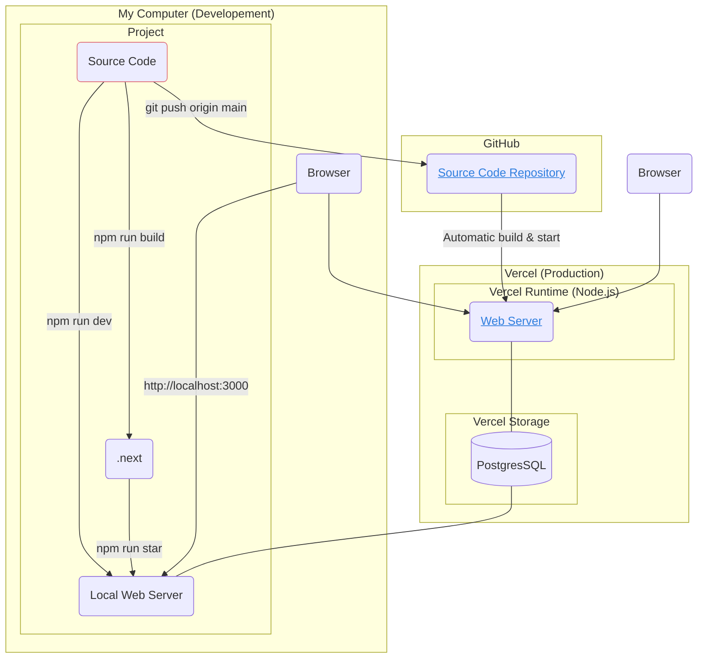

# Node.js Environment

[Next.js Dashboard App](https://nextjs.org/learn/dashboard-app) is an official learning example provided by Next.js. Once you follow the example, the development and deployment environment appear as shown in the following diagram.

The dashboard app includes login/logout functionality and features for creating, editing, and deleting invoices. However, there is no signup function available. Login information to access the website is provided at the bottom of [the page of this link](https://nextjs.org/learn/dashboard-app/adding-authentication). The Dashboard App running can be visited by clicking on the link in the diagram.

## Background
The reason I created this diagram primarily pertains to databases. In most traditional development environments, particularly for exemplary projects, a database typically runs locally inside a server. When I received a question about database connections from an experienced software engineer, I decided to draw this diagram. For this project, I do not have a locally running database. Only Vercel Postgres is used for development, as well as for production.

Github is one of the remote git repository services. Once Github and Vercel are connected, a Next.js project can be deployed on Vercel with minimal configuration. If I push the code to Github, it will be automatically built and deployed on the Vercel server. Therefore, the site is already running in a production environment, accessible to anyone.

For instructions on how to set up Github, Vercel, and Vercel Postgres, please refer to the [link](https://nextjs.org/learn/dashboard-app/setting-up-your-database) provided.

## Environment Setup
